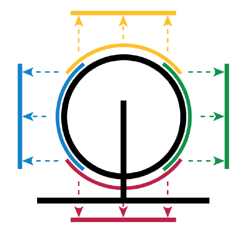
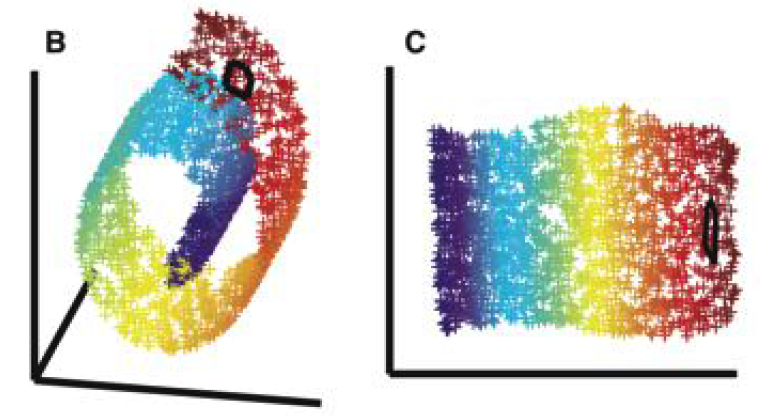
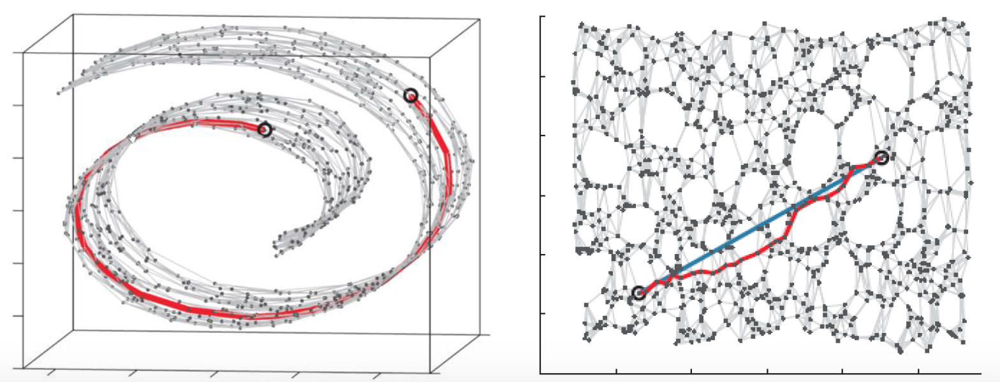
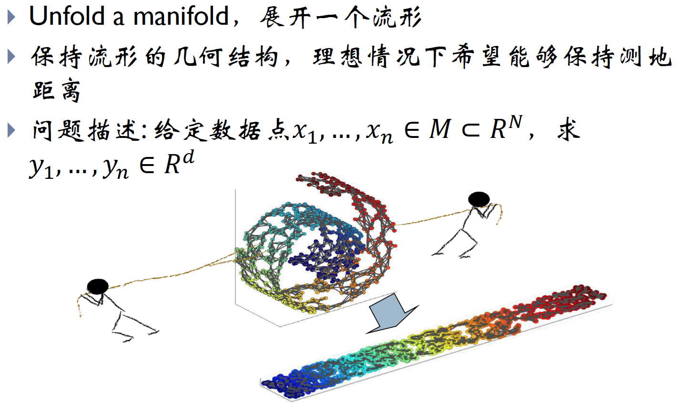

流形学习，什么是流形，流形学习到底在学什么？

这个概念其实困扰了我一段时间。之前使用variational Auto-encoding去做无
	监督学习，其中涉及到流形的相关概念，vae对高维数据进行流形学习，能够学习得
	到有效的数据流形结构，同时获得泛化能力强的低维特征表达。该算法基于的假设就
	是：数据虽然高维，但相似数据可能分布在高维空间的某个流形上，而特征学习就要
	显式或隐式地学习到这种流形。正是这种流形分布，我们才能从低的隐变量恢复出高
	维的观测变量。

要理解流形学习，还是先从概念讲起。流形学习，英文全称为manifold 
	learning，是机器学习、模式识别中的一种方法，在维数降维方面具有广泛的应
	用。Manifold=Many fold，很多曲面片的叠加。注意这里是叠加，不是拼接，不
	自交，见图1。欧式空间属于流形，任何一个流形都可以嵌入到足够高维度的欧式空间
	中(Whitney 嵌入定理)。科普一下，“流形”这个中文词取自文天祥的“天地有正气，杂然赋流形”，这个词第一次作为当前的数学意义使用是由北大数学系的一位老教授江泽涵老先生。老先生是我国代数拓扑学的开拓者。
	
比如说一块布，可以把它看成一个二维平面，这是一个二维的欧氏空间，现在我们	（在三维）中把它扭一扭，它就变成了一个流形（当然，不扭的时候，它也是一个流
	形，欧氏空间是流形的一种特殊情况）。

所以，直观上来讲，一个流形好比是一个 d 维的空间，在一个 m 维的空间中 (m > d) 被扭曲之后的结果。需要注意的是，流形并不是一个“形状”，而是一个“空间”，
如果你觉得“扭曲的空间”难以想象，那么请再回忆之前一块布的例子。广义相对论似
乎就是把我们的时空当作一个四维流（空间三维加上时间一维）形来研究的，引力就
是这个流形扭曲的结果。当然，这些都是直观上的概念，其实流形并不需要依靠嵌入
在一个“外围空间”而存在，稍微正式一点来说，一个 d 维的流形就是一个在任意点
出局部同胚于（简单地说，就是正逆映射都是光滑的一一映射）欧氏空间 
$R^d$ 。实际上，正是这种局部与欧氏空间的同胚给我们带来了很多好处，这使得我们在日常生活中许许多多的几何问题都可以使用简单的欧氏几何来解决，因为和地球的尺度比起来，我们的日常生活就算是一个很小的局部。

它的主要思想是将高维的数据映射到低维，使该低维的数据能够反映原始高维数据的
	某些本质结构特征。流形学习的前提是有一种假设,即某些高维数据，实际是一种低维
	的流形结构嵌入在高维空间中。流形学习的目的是将其映射回低维空间中，揭示其本
	质。

为什么说高维空间映射到低维空间，能够相对保证能够学习到原始空间中的本质结构特征？

    这是因为高维中的数据往往会产生维度上的冗余，实际只需要以较低维就能唯一表
	示。

以下图为例1，左边是一个三维数据的分布，右边是降维到二维后的结果。可以发现二
	维的数据更能直观地表示其流形结构。

通过流形学习来实现降维的方法有很多，其基本思想类似：假设数据在高维具有某种
	结构特征，希望降到低维后，仍能保持该结构。

再举一个例子2，更容易理解：
	三维空间中一个地球，用x，y,z三个坐标轴确定时会产生冗余（很多在三维空间中的
	点并不在球面上）。但其实只需要用两个坐标（经度和纬度）就能确定。实际上三维
	空间的球面其实是一个二维流形。

流形学习有什么用？

（1）高维空间有冗余，低维空间冗余度更低，甚至没有冗余。也就是说，流形可以作
	为一种数据降维的方式。传统降维算法都是用欧式距离作为评价两个点之间的距离函
	数。但这种方式并不总是合理，比如例子2中提到的三维空间中的球面，计算球面上两
	个点的距离，如果仅仅使用三维坐标系中的尺度去衡量，显然不对。我们更希望得到
	的是两点的球面距离。也就是把三维地球展开成二维平面，然后测量地表上的距离，
	而不是三维空间中球面上两个点的空间直线距离。

再看例子1中，B中图表示的是形状熟称“瑞士卷”，以瑞士卷为例子，阐述流形学习的
	适用情形。

图中两个黑色圆圈，在流形(展开卷)上距离非常远，但是用三维空间的欧式距离来计
	算则他们距离会很近。所以说，流形学习的一个主要应用就是“非线性降维”。非线性降维考虑到流形的问题，所以降维过程中不但会将距离纳入考量，更会考虑到升恒数据的拓扑结构，参考下图3，帮助更好的理解。

较常见的经典算法有：
	1.局部线性嵌入(Local linear embedding, LLE)
	假设数据中每个点可以由其近邻的几个点重构出来。降到低维，使样本仍能保持原来
	的重构关系，且重构系数也一样。

2.拉普拉斯特征映射(Laplacian Eigenmaps, LE)
	将数据映射到低维，且保持点之间的(相似度)距离关系。即在原空间中相距较远的
	点，投影到低维空间中，它们之间仍相距较远，反之亦然。

此外还有 局部保持投影、等距映射（Isomap）等，可以看一下浙大何晓飞关于流形
	学习的介绍。

(2)流形能够刻画数据的本质。这也是深度学习主要针对解决的问题。深度学习主要
	的作用其实就是“特征表达”的学习。所谓特征，就是能表示事物本质的内容，一般来
	说特征的维度应该小于数据本身。比如识别一个人脸，眼睛、鼻子、嘴等都是关键性
	的基本特征，具体到不同人，在这些基础特征上，增加各个器官之间的距离，形状等
	特异性内容即可。可以看到，这里谈到的特征，在一定程度上可以用流形的概念来解
	释。流形学习，我们希望模型能够学习到“数据在流形空间中的表示”，就是瑞士卷结
	构中两个黑色圆圈的距离，在低维（瑞士卷展开）后依然距离较远。

文章开头提到的vae，就是对数据流形结构进行学习。适用半监督学习，主动学习。简单地说，在 supervised learning 中，我们只能利用有 label 的数据，而（通常都会有很多的）没有 label 的数据则白白浪费掉。在流形假设下，虽然这些数据没有 label ，但是仍然是可以有助于 Learn 出流形的结构的，而学出了流形结构之后实际上我们就是对原来的问题又多了一些认识，于是可以期望能得到更好的结果。

当然，所有的这些都是基于同一个假设，那就是数据是分布在一个流形上的（部分算法可能会有稍微宽松一些的假设），然而 real world 的数据，究竟哪些是分别在流形上的呢？这个却是很难说。不过，除了典型的 face 和 hand written digit 之外，大家也有把基于流形的算法直接用在诸如 text 看起来好像也流形没有什么关系的数据上，效果似乎也还不错。我们曾将金融领域的数据用于学习流形，确实也得到了更好的预测效果。

如何说明“模型学习到了流形”？

前面提到高维数据其实是由低维流形生成的，高维数据实际是一种低维的流形结构嵌
	入在高维空间中。

流形学习的展望

研究数据的几何和拓扑，对于人们认识数据和处理数据具有本质意义。

挑战

现有方法对于数据的要求比较高，对噪音的情况处理能力不够。流形学习算法往往是
	要求一个整体的矩阵分解，很难处理大规模数据。

